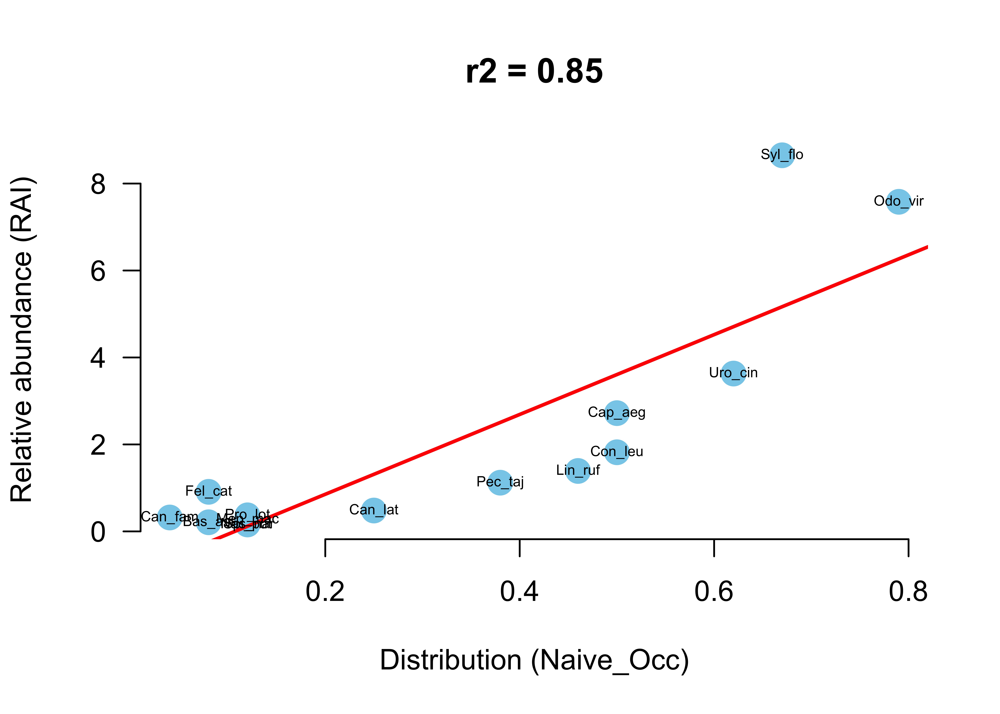
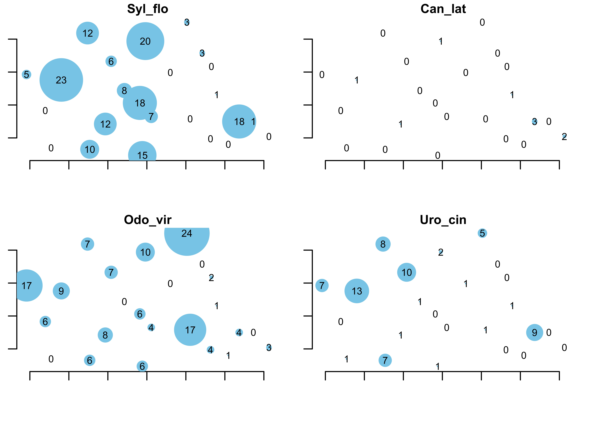
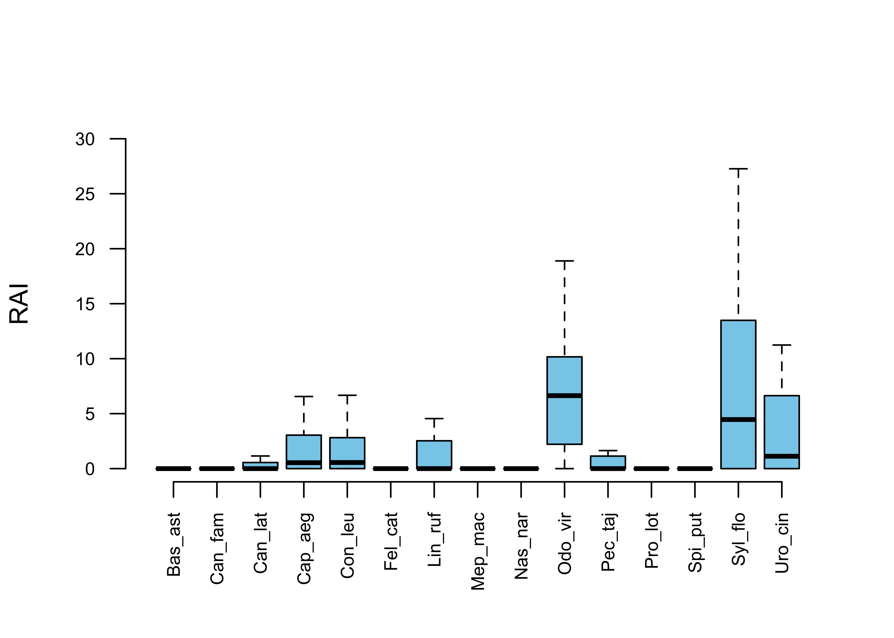
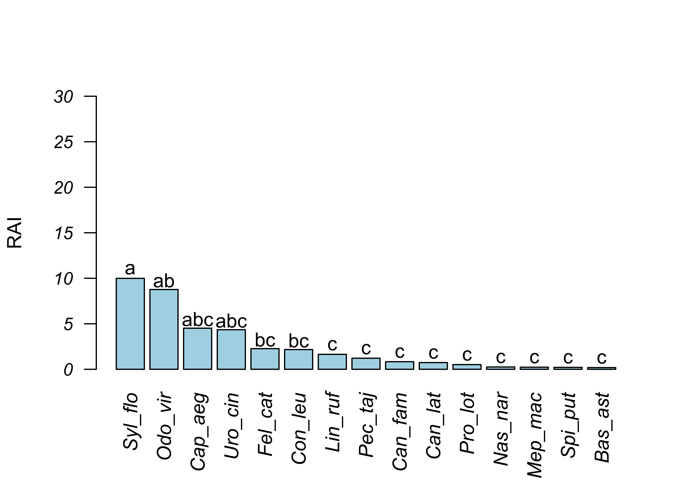
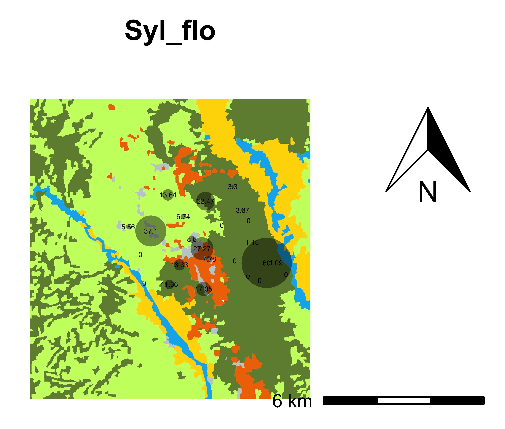
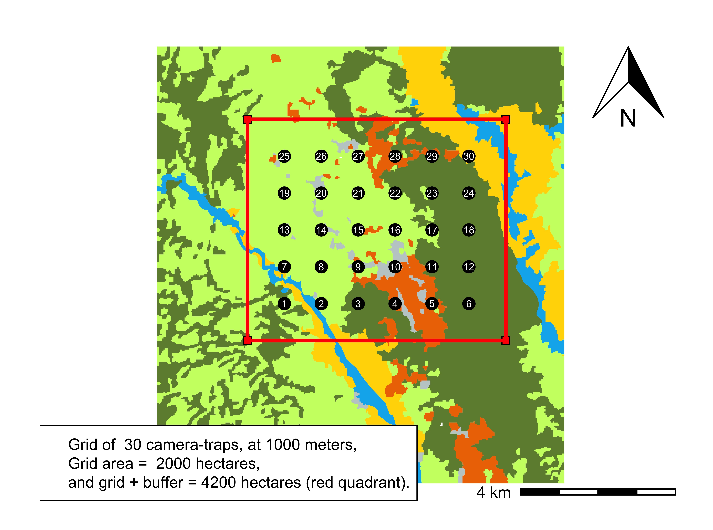

# General description

The main propose of this package is to provide different functions to calculate the RAIs for the species captured with cameras-traps in the same or different locations and seasons. The `RAI` package was development with few functions that allow automatic store of tables, statistical results, figures and maps. 

In this vignette I introduce the R package `RAI` developed to estimate relative abundance indices for different species through photo-trapping data. The package allows to comparison of RAI among species or between selected single species. I presents a step-by-step the procedure for estimating the RAI considering three models: 

1) Traditional or classical RAI where total data are grouping for each species; 

2) Alternative RAI that allows estimating the variation considering the data from each camera; and 

3) As a generalized Poisson-type linear model with offset. 

# Assumptions

## Population abundance (N) 

Census or counting all the individuals in a population is not a common practice for most wildlife species. Instead, usually is counted fraction of individuals (*C* or *n*) and from this the size or abundance (*N*) of the population is statistically inferred. In some cases all individuals are detected (*p* $\equiv$ 1.0) in the sampling units (e.g., strip transects), but in most situations the detection probability is lower (*p* < 1.0). Therefore, the expected counts is: 

\begin{equation}
E(C) = Np.
\end{equation}

When the probability of detection is estimated then the abundance is:

\begin{equation}
\hat{N} =  \frac{C}{\hat{p}}.
\end{equation}

According to this equation, as $\hat{p}$ approaches 1.0, then counts (*C*) is good index of the relative abundance.

## RAI assumptions {-}

The calculation and interpretation of the relative abundance indices is relatively simple: based on the RAI value, is evaluated if a population of some species is relatively more or less abundant in the same site at different times, or among sites. This interpretation is qualitative and frequently subjective (lacks of statistical rigor) but it is reported in many studies as an indirect measure of the abundance of each species. Therefore, to comparison of temporal/spatial relative abundance of the same species:  

\begin{equation}
RA = \frac {C_2} {C_1} = \frac {p_2 N_2} {p_1 N_1}, 
\end{equation}

thus, if RA > 1 then population increased since counts $C_2$ is relatively greater than $C_1$; while if RA < 1 then population decreased from $t_1$ to $t_2$. However, if $p_1$ $\neq$ $p_2$ then *C* is not a good index, and this could be the common case because the detection varied as consequence of several factors.

The main assumptions of the RAIs are: 

1) There is a positive linear relationship between abundance (*N*) and counts (*C*); 
2) The detection probability (*p*) is perfect, *p* $\equiv$ 1.0; and
3) *p* is constant on average over time and space.

Alternative additional assumption is:

4) Variation in *p* is small relative to variation in *N*.


```{r NRAI, echo=FALSE, message=FALSE, warning=FALSE, out.width = "75%", fig.align = 'center', fig.cap= "Figure. 1. Hypothetical relationships between the relative abundance index (RAI) and real abundance (N). a) Comparison of two populations of the same species but with linear and non-linear relationships; and b) comparison among three species with different intensity in the relationship between RAI and N. In both examples, at the same RAI value (open point), the N could be different for each population and species (black point), respectively."}
knitr::include_graphics("fig/indices2.jpg")
```

Respect to assumption 1, the relationship between the true abundance and the index could not be linear in some cases, and this is a very sensible assumption to comparison of RAIs among the same or different species (Fig.1). Unfortunately, in the majority of the studies this assumption is unknown and then the interpretation of the RAIs may be bias. Assumption 2 is a very sensible, and is met in the few cases when is applied a population or sampling census; however, usually *p* < 1.0. Assumption 3 could be met using similar field procedures and conditions. Assumption 4 is interesting but complicate to test and may be could be applied for species with slow population increase rate. Therefore, this implies that is need some estimation of the detection probability; however, traditionally the RAIs does not considered this and is the principal limitations. Alternatively, it is desirable some empirical test about the relationship between RAI and abundance/density derived from different independent methods.

# Models

## Classic or general RAI model

The most frequent way to estimate the RAI is grouping the information obtained in all camera-traps for each species. Then a period of time is defined in which the photos are considered independent, usually 24 h. However, the definition of independent events is a crucial aspect and could bias the RAI estimation, principally for common species. Then, the number of independent photos is divided by the total sampling time expressed as day or night-trap and multiplied by 100. For some species (e.gr., felines, tapir) with very low records, is common to multiply by 1000. Therefore, the RAI is simply an photographic or encounter rate (sometimes also called frequency of capture) that expresses the average number of photos per 100 days of sampling. The formula to calculate the RAI, is:

\begin{equation}
RAI_ {i} = \frac {n_{tot}} {days_{tot}} = \frac {\sum n_j} {\sum day_j} =  \times 100,
\end{equation}

where: $n_{tot}$ is the total number of independent photographic records of the *i* -species in the *j*-camera ($n_j$); and $day_{tot}$ is the sampling effort or total number of days ($day_j$). Thus, the RAI assumes that as higher value greater the abundance of the species. An important aspect is that RAIs is not expressed as the number of individuals in the population but simply as an index. However, this classic model does not consider the number of photos obtained in each camera-trap, consequently in this model it cannot be distinguished if the photos come from one or a few cameras as results of the activity of the same or few individuals. Also this model not allow statistical comparison, and this is one of the major limitation.

## Alternative RAI model

A simple way to statistically compare the RAI between species in the same locality in different time (seasons/years), or spatial (regions/habitats) and also to detect what cameras provides the major data, is calculating the RAI per camera-trap, as:

\begin{equation}
RAI_ {ij} = \frac {n_j} {days_j} \times 100.
\end{equation}

Therefore, this equation calculates not only the average but also allows estimating some measure of the variation, such as the deviation or standard error. 

## GLM Poisson RAI model

A different way of analyzing the photo-trapping data and calculating the RAI is as generalized linear model (GLM). Considering that counts are not normally distributed, is necessary some other statistical distribution and the initial candidate is the Poisson distribution. Note that if the number of days were exactly the same for all cameras, then the number of photos could simply be used as a relative abundance. However, because is common that sampling effort days varied among camera-traps, an appropriate way to incorporate this is to consider the effort days as “offset”. The Poisson-type GLM where this heterogeneity could be incorporated in the *j*-camera, is:

\begin{equation}
\begin{split}
n_ {ij} \sim Poisson(Days_j * \lambda_j) \\
log (Days_j * \lambda_j) = \alpha_i + 1 * log (Days_j) + \beta * x,
\end{split}
\end{equation}

where *i* is the species, *j* is the camera, $\lambda$ is the expected abundance (i.e., the mean abundance over all sites sampled or not), and *x* any characteristic or covariate that affects or is related to the RAI. An important aspect of this model is that when $\beta * x = 0$, then $\alpha$ is exactly the classic RAI model, for the *i*-species.

# `RAI` Package

## General description 

The main propose of this package is to provide different functions to calculate the RAIs for the species captured with cameras-traps in the same or different locations and seasons. The `RAI` package was development with few functions that allow automatic store of tables, statistical results, figures and maps. A full list of functions available in `RAI` is provided in Table 1.

```{r func, echo=FALSE, message=FALSE, warning=FALSE}
library(tidyverse)
RAI_f <- read.csv("csv/RAI_f.csv", header = T)
knitr::kable(RAI_f, caption = "Table 1. Functions and description of the RAI package.", booktabs = T)
```

# Initial steps

First install the Beta version of the `RAI` package, from:

```
library(devtools)
install_github("SMandujanoR/RAI")
library(RAI)
```

Next create a subdirectory to automatically save the results (tables, graphs, maps, statistical analysis) generated by the different functions, as:

```
dir.create("Results")
```

# Analysis of several species 

### Data

To exemplify the use of the `RAI` package, I selected here a specific data set of 15 medium and large size mammals species and habitat covariates obtained from 24 camera-traps at 1 km of distance in 6000 ha, during wet season of 2018 in the Tehuacán-Cuicatlán Biosphere Reserve in Oaxaca, Mexico. 

To use the `RAI` package, previously the data must have a correct format. Since the package `camtrapR` is actually used to organize and analyzed data of camera-trap, to format the data follow this steps:

First, read species data:

```
data_Spp <- read.csv("data/camtrapR_data.csv", header = T)
```

Second, read camera operativity:

```
data_CT <- read.csv("data/CT_operativity.csv", header = T)
```

Then, format the data to use the `RAI` function:

```
dataFormat(data_Spp, data_CT, speciesCol = "Species", stationCol = "Station", setupCol = "Fecha_colocacion", retrievalCol = "Fecha_retiro", CTDateFormat = "%d/%m/%Y")
```

This function generate the file `wildlife_data.csv` necessary to use with this package. See `?RAI` for details.


### Read data

To estimate RAIs is necessary to load two files: The first is the previously formatted `wildlife_data.csv`, and the second the file contained the covariates of each camera-trap. The first include data of animals organized in four columns: Camera, Species, Events and Effort (Table 2). Note that in cases where the species was not photographed, is necessary to include 0s in the Events. Read data, as:

```
wildlife_data <- read.csv("data/mamiferos.csv", header = T)
```

```{r tab1, echo=FALSE, message=FALSE, warning=FALSE, results='asis'}
wildlife_data <- read.csv("csv/mamiferos.csv", header = T)
knitr::kable(head(wildlife_data, 15), caption = "Table 2. Example of the basic data.frame using by the package RAI: camera-trap key, species key, number of independent records or events (every 24 h), and sampling  days (effort). Here, data of one camera-trap is presented.", booktabs = T) 
```

An important aspect is to keep always the same names of the columns in this `data.frame`:

```
names(wildlife_data)
[1] "Camera"  "Species" "Events"  "Effort" 
```

If you use the complete Latin scientific name for species, is preferable to abbreviation, as:

```
library(fuzzySim)
wildlife.data$Species <- spCodes(wildlife_data$Species, sep.spcode = "_")
```

This could be completed by the previous function `dataFormat()`. To see the species:

```
unique(wildlife_data$Species)
[1] "Bas_ast" "Can_lat" "Nas_nar" "Syl_flo" "Con_leu" "Lin_ruf" "Pro_lot" "Odo_vir" "Pec_taj" "Spi_put" "Mep_mac" "Uro_cin" "Can_fam" "Cap_aeg" "Fel_cat"
```

The second `data.frame` contains the UTMs and habitat covariates for each camera-trap (Table 3), read as:

```
habitat_data <- read.csv("habitat.csv", header = T)
```

```{r tab2, echo=FALSE, message=FALSE, warning=FALSE, results='asis'}
habitat_data <- read.csv("csv/habitat.csv", header = T)
knitr::kable(head(habitat_data), caption = "Table 3. Example of the data of UTMs and covariates for each camera-trap.", booktabs = T)
```

Then merge both `data.frames` as:

```
datos <- merge(x = wildlife_data, y = habitat_data, by = "Camera", all = TRUE)
```

This last object (in this example called `datos`) will be used in almost all `RAI` functions.

## Classic RAI model {-}

To calculate RAI, use:

```
RAIgral(datos, c("Syl_flo", "Odo_vir", "Can_lat", "Uro_cin"), parRow = 2, parCol = 2, pointSize = 0.3)
```

This function calculate the RAI and naive occupation for each species (Table 4). 
 
```{r tab3, echo=FALSE, message=FALSE, warning=FALSE, results='asis'}
RAIgral <- read.csv("csv/Table_1.csv", header = T)
knitr::kable(RAIgral, caption = "Table 4. Number of cameras used, sampling days, number of independent events (n), estimation of RAI and naive ocupation for each species.", booktabs = T) 
```

Also automatically generated and store the graph of the relationship between the RAI and naive occupation in the Results carpet (Fig. 2). This function also allows to view the records of selected species by camera, as example for 4 species (Fig. 3). It is important in this graph  to check the heterogeneity in the distribution of the number of photos obtained of the different species in each camera. This allow to know if records comes homogeneously from different cameras, or from 1 o few which could be the result of photographed repetitively of the same individuals which bias the interpretation of the RAI. See `?RAIgral` for details of parameters of this function.

```{r Ndist, echo=FALSE, message=FALSE, warning=FALSE, out.width = "95%", fig.cap= "Figure 2. Relationships between the RAI and naive occupation, and determination coefficient."}

```

```{r dist, echo=FALSE, message=FALSE, warning=FALSE, out.width = "95%", fig.cap = "Figure 3. Example of distribution of independent events of the selected species by camera-trap."}

```

## Alternative RAI model {-}

To calculate the RAI, use: 

```
RAIalt(datos, ymax = 30) 
```

The mean estimated with this model is very similar to that obtained by the classic model, but this alternative model allows to estimate variation for statistical comparisons. The results is present in Table 5 and boxplot (Fig. 4).

```{r tab4, echo=FALSE, message=FALSE, warning=FALSE, results='asis'}
RAIalt <- read.csv("csv/Table_2.csv", header = T)
knitr::kable(head(RAIalt, 20), caption = "Table 5. Estimation of RAI for species in each camera-trap. Only the first 20 rows are showed.
", booktabs = T)
```

```{r boxplot, echo=FALSE, message=FALSE, warning=FALSE, out.width = "95%", fig.align = 'center', fig.cap= "Figure. 4. Boxplot of the relative abundance index (RAI) for each species."}

```

Additionally, this function create and store two arrays contained the estimation of Events (Table 6) and RAIs (Table 7) for each species and camera-trap. These could be used in other R packages, for example `iNEXT`, to estimation of diversity index, and for multivariate analysis.

Table 6. Matrix of independent events per species in each camera-trap.

```{r, echo=FALSE, message=FALSE, warning=FALSE, results='asis'}
x1 <- read.csv("csv/Table_Spp_Events.csv", header = T)
knitr::kable(head(x1, 10), caption = "Table 5. Estimation of RAI for species in each camera-trap. Only the first 20 rows are showed.", booktabs = T)

```


```{r, echo=FALSE, message=FALSE, warning=FALSE, results='asis'}
x2 <- read.csv("csv/Table_Spp_IAR.csv", header = T)
knitr::kable(head(x2, 10), caption = "Table 7. Matrix of independent RAI per species in each camera-trap.", booktabs = T)
```

## Statistical analysis

The `RAIalt()` function automatically generates various statistical analyzes. First, a parametric analysis of variance test is performed to statistical comparison of the RAI differences among species (Table 8). 

```{r, echo=FALSE, message=FALSE, warning=FALSE, results= "asis"}
Tab_aov <- read.csv("csv/Table_ANOVA.csv", header = T)
knitr::kable(Tab_aov, caption = "Table 8. Analysis of variance to compare the RAI among species.")
```

Second, if the F-value is significant (P < 0.05), then two posterior tests are performed: the HSD (Fig. 5) and the Tukey (Fig. 6) for comparison of RAI value among species.

```{r hsd, echo=FALSE, message=FALSE, warning=FALSE, out.width = "95%", fig.align = 'center', fig.cap= "Figure 5. Posterior HSD test to comparison of RAI between pair of species. Similar letters (a,b,c) indicates no significant differences (P $>$ 0.05)."}

```

```{r tukey, echo=FALSE, message=FALSE, warning=FALSE, out.width = "75%", fig.cap= "Figure 6. Result of the Tukey posterior test between the RAI of pairs of species. The difference is significant if the horizontal line does not cross the dotted vertical line at the value 0."}
knitr::include_graphics("fig/Tukey_test.jpg")
```

## GLM Poisson model {-}

To calculate the RAI for all species through the generalized linear model type Poisson regression (Table 8), use the function:

```
RAIglm(datos, family = "quasipoisson") 
```

This function performs a simple estimation of RAI for each species when there is not covariates in the model, and brings the same estimation as the general RAI model. 

```{r, echo=FALSE, message=FALSE, warning=FALSE}
Tab_glm <- read.csv("csv/Table_GLM.csv", header = T)
knitr::kable(Tab_glm, caption = "Table 8. Coefficients of the generalized linear Poisson regression model estimated for each species.") 
```

## Final results {-}

To obtain the final summary of the different RAIs models per species (Table 9), use the function:

```
RAIfinal(datos)
```

```{r tabfinal, echo=FALSE, message=FALSE, warning=FALSE, results='asis'}
RAI <- read.csv("csv/Table_3.csv", header = T)
knitr::kable(RAI, caption = "TABLE 9. Final summary of the results of the RAI obtained with the different models for each species in the study location.", booktabs = T) 
```

# Analysis of one species

## Models

Frequently, the population trend of a certain species is monitored, for this purpose the RAI package allows specific analyzes to compare the RAI of the same species in different seasons and/or locations. For this propose use: 

```
RAIglmSp(Species = "Syl_flo", covs = c("Veg_type", "Loc_dist", "scrub", "Goats"), family = "poisson")
```

In this GLM the principal assumption of Poisson model is that mean is equal to variance, and this could be tested using.... As an alternative is to use the Quassipoisson model.   

## RAI distribution map

The `RAI` package allows create different distribution graphs and maps of the selected species. First load the shapefile of the study area, and if necessary modify the projection, as:

First, load the package:

```
library(raster)
```

Then read the shapefile as:

```
mi_mapa <- shapefile("data/veg.shp")
mi_mapa <- spTransform(mi_mapa, "+proj=utm +zone=14 +datum=WGS84 +units=m +no_defs +ellps=WGS84 +towgs84=0,0,0")
```

To visualize the vegetation classification, use:

```
mi_mapa$tipo_Suelo
[1] "Irrigated agriculture" "Permanent river" "TDF Neo" "TDF Mim" "Saltworks" "Scrub-cras" 
```

Then use the default R colors, or create your own palette according with the different vegetation types (or any other clasification), as:

```
mi_paleta <- c("gold", "deepskyblue2", "darkolivegreen4", "darkolivegreen1", "azure3", "darkorange2")
```

To generate a map of the study location with the RAIs of the selected species in each camera-trap  (Fig. 7), select the name of the species, and your colors, as:  

```
RAImapSp(map = mi_mapa, species = "Syl_flo", pointSize = 0.2, mycolors = mi_paleta)
```

An important aspect is that this function works only if the XY data of the species are in the same projection coordinates as the map shape. 

```{r map, echo=FALSE, message=FALSE, warning=FALSE, out.width = "75%", fig.align = 'center', fig.cap= "Figure 7. Distribution map of RAI of the selected species in the study site. In this example the Cotton rabbit (Syl-flo). The gray circles represents the independent events in each camera-trap."}

```

## Kernel density map

To create a distribution utilization (UD) map using the kernel density (Fig. 8) and to create raster format map (Fig. 9), use:

```
RAIkernelSp("Syl_flo", S = 0.7, HR = 75, pointSize =  20, proje = "+proj=utm +zone=14 +datum=WGS84 +units=m +no_defs +ellps=WGS84 +towgs84=0,0,0", mycolors = hcl.colors(99, palette = "viridis", alpha = NULL, rev = F)) 
```

```{r KernelMap, echo=FALSE, message=FALSE, warning=FALSE, out.width = "75%", fig.align = 'center', fig.cap= "Figure 8. Estimation of the utilization distribution kernel density of the selected species."}
knitr::include_graphics("fig/Kernel_Syl_flo.jpg")
```

```{r, echo=FALSE, message=FALSE, warning=FALSE, out.width = "75%", fig.align = 'center', fig.cap= "Figure 9. Raster map of the kernel density of the selected species."}
knitr::include_graphics("fig/KernelRaster_Syl_flo.jpg")
```
 
## Alternative data (*en construcción*)

A second set of data will be used here where additional information is include as different spatial locations and temporal sampling events:

```
data(mammalsCB2)
str(mammalsCB2)
```

Then select the location and season, using the function:

```
RAIsp(species = "Syl_flo", site = "San_Pedro_Chico", season = "Dry")
```

# Other functions

## Grid design

The `RAI` package allow also to create a simple grid design of camera-traps (Fig. 10 and Table 10). For example, 35 cameras at 1000 m distance, introduce the initial XY-UTMs, as:

```
mi_Grid(n1 = 5, n2 = 7, CTx = 690500, CTy = 2007000, CTdist = 1000)
```


```{r grid, echo=FALSE, message=FALSE, warning=FALSE, out.width="75%", fig.cap= "Figure 10. Example of creating a grid of 35 cameras in a 5 x 7 arrangement every 1000 m."}

```


```{r tabgrid, echo=FALSE, message=FALSE, warning=FALSE, results='asis'}
utm <- read.csv("csv/UTMs_grid.csv", header = T)
knitr::kable(head(utm, 10), caption = "Table 10. Data of the UTMs of each camera-trap created by the grid function.") 
```

## RAI simulation (*en construcción*)

An important aspect is to know how RAI is affected by different factors. This package allow to simulate the RAI considering the number of cameras-trap (CT) and independent events, using: 

```
RAIsim(datos, CT = x, IndEve = x, nsim = X)
```

# RAI limitations

The estimation of RAIs as index of population abundance is common with data obtained with camera-traps, and the `RAI` package covers basic calculation to this purpose considering three models to generate graphs, tables, maps, statistics, easy to import in thesis, manuscripts, presentations, and others. However, before deciding to use RAIs, it is necessary to take into account the following sampling factors that severely limit as an indicator of population abundance: 1) the field design including site, number, distance among cameras, models of camera-traps; 2) the definition of number of independent counts; and 3) possible biases due that cameras are often placed for obtain data of specific species, for example top predators, and then the data of the other species photographed are used to calculate the RAIs.

However, here I focus on two fundamental aspects: Are RAIs indicators of population abundance or should simply be interpreted as encounter rate (photographic rate, frequency of capture)?, and Is it valid to compare RAIs among different species? 

First, the principal limitation of the RAIs as estimate of population abundance is that not considered the effect of the detection probability. To exemplify this sensible aspect, I used the function `simNpC` of the package `AHMbook`, in order to simulate the effect of the detection probability on counts and its interpretation as population index (Fig. 11). As the detection probability (*p*) varies along of temporal or spatial dimension, the effect on counts (*C*) animals varies; in consequence, RAIs are not good indicator of population abundance (*N*), except in the specific case when detection probability it is constant. 

```{r simKR, echo=FALSE, message=FALSE, warning=FALSE, out.width = "31%", fig.align = 'center', fig.cap= "Figure 11. Example of simulation of the effect of the variation in detection probability on counts. In the three cases, the real population abundance (black points) is constant along the temporal or spatial dimension; but counts (open points) varies depending the probability of detection. a) The ideal situation when counts is a good index tracking (dash line) the real population abundance (black line). The cases b) and c) when wrongly index suggest a decline or increase when actually real population abundance is stable, respectively. Note that comparison of a specific population species could be temporal (month, season or year) or spatial (locations, habitat types, landscapes).", fig.show='hold'}
knitr::include_graphics(c("fig/Rplot1.jpeg", "fig/Rplot2.jpeg", "fig/Rplot3.jpeg"))
```

The RAIs are affected by the detection which depends on several factors as: 1) characteristics of the species (abundance, size, shape, color, home range, distance, speed of movement); 2) characteristics of the site (structure and heterogeneity of the habitat, vegetation cover, topography, human activity); 3) conditions during sampling (time of year, phenology of vegetation, climatic conditions, time of day); and 4) sampling design (camera model, sampling effort, distance between sampling units,  experience). 

Second, considering that camera-traps is used to comparison of RAI among different species, a crucial issue is that if is conceptually valid to comparison of this index among species. Even the `RAI` package performs statistical analysis of the comparison of RAIs among species, the critical aspect that limits this comparasion is the lack of consideration of the detection probability which could varies among species (see Fig. 1). Therefore, taking these limitations it is suggest to be careful in the use, interpretation and conclusions about abundance comparison among species based on RAIs. 

Therefore, a conceptual and analytically alternative approach is the hierarchical modelling (HM), and could be suitable for data obtained by camera-traps. The HMs allow simultaneously modeling the state or ecological process (abundance, density, distribution and richness) and the observational process (probability of detection). As consequence, the use of HMs in ecology has increased considerably during the last decade. 

In conclusion, previously to analyzed the data obtained with camera-traps, it is important to known the different analytically methods. In this sense, the `RAI` package introduced in this paper, could be useful as initial exploratory data analysis in order to known and visualization some spatial and temporal trends in the encounter rates of the photographed species.

# Citation {-}

To cite the `RAI` package should cite this article and indicate the used version of the package. The citation information for the current package version can be obtained using: 

```{r message=FALSE, warning=FALSE, paged.print=FALSE}
citation("RAI")
```


# RMarkdown session

This vignette was generated using:

```{r, echo=FALSE, message=FALSE, warning=FALSE}
sessionInfo()
```


